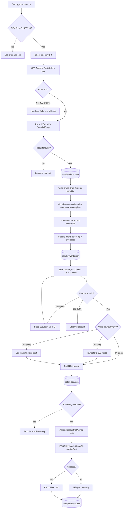

# Zero-Cost AI SEO Blog Post Creation Tool

An automated pipeline that scrapes trending e-commerce products, researches SEO keywords, generates
optimized blog content with AI, and publishes to **Hashnode** — using **100% free-tier services**.

**Verified result: 17 blog posts published to a live Hashnode publication on 2026-01-24.**

```bash
# Verify the published output yourself - no credentials needed
curl -s https://smitmakodia.hashnode.dev/sitemap.xml | grep -o "<loc>[^<]*</loc>"
```

---

## Workflow Architecture



<details>
<summary><b>Text version of the workflow</b> (click to expand — use this if the diagram above does not render)</summary>

```text
TRIGGER   python main.py  ->  interactive category prompt (1-4)
          Guard: exit 1 if GEMINI_API_KEY is unset

STAGE 1   PRODUCT DISCOVERY                                    src/scraper.py
          Sleep 2-5s (randomised) -> GET Amazon Best Sellers URL
            HTTP 200          -> parse with BeautifulSoup + lxml
            non-200 / error   -> headless Chrome via Selenium, load + scroll, parse
          Per product: title, price, rating, URL, ASIN, rank, timestamp
          Guard: zero products -> log error, exit 1
          OUT: data/products.json

STAGE 2   KEYWORD RESEARCH          src/product_analyzer.py + src/keyword_research.py
          Title -> brand, product type, features (regex + fixed lists)
          -> seed phrases ("[brand] [type] review", "best [type]", problem templates)
          -> Google Autocomplete (up to 6 per seed) + Amazon Autocomplete (up to 8)
          -> relevance score: brand .25 | type .35 | feature .15 | overlap .15 | similarity .10
          -> drop anything below 0.35
          -> classify intent: transactional / commercial / informational / navigational / mixed
          -> round-robin one per intent bucket until 4 selected
          Guard: nothing selected -> use truncated product title
          OUT: data/keywords.json

STAGE 3   CONTENT GENERATION                            src/blog_generator.py
          Prompt: product facts + 1 primary + 3 secondary keywords
                + structure spec + 150-200 word target + JSON-only instruction
          Call gemini-2.5-flash-lite
            429             -> sleep 35s, retry (max 3 attempts)
            JSONDecodeError -> abandon this product, continue with the rest
            OK              -> strip code fences -> json.loads
          Length: too long -> truncate to 200 words
                  too short -> log warning, keep the post anyway
          OUT: data/blogs.json

STAGE 4   PUBLISHING                                       src/publisher.py
          Only if PUBLISH_TO_HASHNODE and both Hashnode credentials are present
          Append "Check out this product: [title](url)" CTA to the Markdown body
          Map up to 5 keywords to tags
          POST https://gql.hashnode.com  mutation publishPost(input: ...)
            failure -> return None, skip post (no retry, no log entry)
            success -> record post id, live URL, title, timestamp
          Sleep 2s between posts
          OUT: data/published.json  + live URLs printed to stdout

OBSERVABILITY  logs/execution_<date>.log + stdout, INFO level (src/utils.py)
```

</details>

---

## Quick Start

### 1. Installation

```bash
python -m venv venv

# Windows
venv\Scripts\activate
# Linux/Mac
source venv/bin/activate

pip install -r requirements.txt
```

### 2. Configuration

```bash
cp .env.example .env
```

Then edit `.env` and add your keys:

| Variable | Where to get it |
|---|---|
| `GEMINI_API_KEY` | https://aistudio.google.com/app/apikey (free) |
| `HASHNODE_ACCESS_TOKEN` | https://hashnode.com/settings/developer |
| `HASHNODE_PUBLICATION_ID` | Your blog dashboard URL or publication settings (UUID) |

> ⚠️ **Hashnode API access now requires a Pro plan.** Hashnode retired free GraphQL API access on
> **2026-05-13**, so the publishing stage will fail on a free account. To run stages 1–3 only, set
> `PUBLISH_TO_HASHNODE = False` in `src/config.py`. The 17 posts linked below were published while free
> access was still available.

### 3. Usage

```bash
python main.py
```

The tool will:
1. Scrape a trending product from an Amazon Best Sellers category.
2. Research keywords via Google Autocomplete and Amazon Autocomplete.
3. Generate a 150–200 word SEO post with Google Gemini.
4. Publish to Hashnode (if enabled and you have API access).
5. Write all artifacts to `data/`.

### 4. Output

| File | Contents |
|---|---|
| `data/products.json` | Scraped product data |
| `data/keywords.json` | Selected keywords with composite scores and intent labels |
| `data/blogs.json` | Generated posts with word counts |
| `data/published.json` | Live URLs and Hashnode post IDs |
| `logs/execution_<date>.log` | Timestamped run log |

---

## How keywords are chosen

Keyword selection is fully deterministic and auditable — every score in `data/keywords.json` can be
recomputed by hand from the source:

1. **Extract** brand, product type and features from the product title (`src/product_analyzer.py`).
2. **Expand** seed phrases via Google Autocomplete and Amazon Autocomplete.
3. **Score relevance** on five weighted signals: brand match (0.25), product-type match (0.35),
   feature match (0.15), title word overlap (0.15), and sequence similarity (0.10).
4. **Filter** out anything scoring below 0.35.
5. **Classify intent** into transactional, commercial, informational, navigational or mixed.
6. **Diversify** — take the highest scorer from each intent bucket in turn until 4 are selected.

> **Note on Google Trends.** A `pytrends` client is constructed in `src/keyword_research.py` but is
> **never called**. It proved too slow and rate-limited when queried per keyword batch, so keyword
> volume falls back to a constant derived from intent class — see the comment at
> `src/keyword_research.py:101`. Keyword ranking is therefore **relevance-and-intent based, not
> search-volume based.** Restoring a real Trends signal (ideally cached, to survive its rate limits) is
> on the roadmap below.

---

## Verified evidence

Everything below is checkable from public endpoints — no credentials, no cloned repo:

| Evidence | How to check |
|---|---|
| **17 live posts**, all published 2026-01-24 | `curl -s https://smitmakodia.hashnode.dev/sitemap.xml \| grep -o "<loc>[^<]*</loc>"` |
| Exact publication timestamps, clustered into **8 batches** | `curl -s https://smitmakodia.hashnode.dev/rss.xml \| grep -o "<pubDate>[^<]*</pubDate>"` |
| Keywords became post tags, and the CTA links to the scraped product | Open any post — tags are the researched keywords, slugified |

Run the pipeline yourself and the local artifacts appear in `data/` and `logs/` (both gitignored, since
they are regenerated output rather than source). In the recorded 2026-01-24 session those artifacts
reconciled to the live feed across all 8 batches at second-level precision, including one batch that
published 2 of 3 after a generation failure.

Sample posts:
- [Snow Joe Ice Melt Reviews](https://smitmakodia.hashnode.dev/snow-joe-ice-melt-reviews-discover-the-premium-blend-for-a-safer-winter) — the post recorded in `data/published.json`
- [Owala Water Bottle 24 oz Review](https://smitmakodia.hashnode.dev/owala-water-bottle-24-oz-review-hydration-hero)
- [DREO Space Heater 1500W Review](https://smitmakodia.hashnode.dev/dreo-space-heater-1500w-review-cozy-up-fast)

---

## Project structure

```
main.py                        Orchestrator - the entry point
requirements.txt               8 pinned dependencies
.env.example                   Template for the 3 required credentials
src/scraper.py                 Stage 1: Amazon scrape, requests -> Selenium fallback
src/product_analyzer.py        Deterministic title -> attributes + seed phrases
src/keyword_research.py        Stage 2: expansion, scoring, intent, selection
src/blog_generator.py          Stage 3: Gemini generation + validation
src/publisher.py               Stage 4: Hashnode GraphQL publishing
src/config.py                  Env loading, paths, thresholds, feature flags
src/utils.py                   Dated file + console logger
```

That is the whole project — every file here is imported and used. Runtime output (`data/`, `logs/`) and
local working material are gitignored rather than published.

---

## Known limitations

- **Publishing requires a Hashnode Pro plan** as of 2026-05-13 (see above).
- **No review gate.** With publishing enabled, generated content goes live unread, and nothing verifies
  the model's factual claims about the product. `PUBLISH_STATUS = "draft"` exists in `src/config.py`
  but no code reads it.
- **No idempotency.** Re-running a category republishes the same product — the 17 posts include
  duplicates.
- **The short-content check does not block.** It logs a warning and keeps the post; the measured sample
  is 149 words against the configured 150-word floor.
- **Scraping depends on Amazon's obfuscated CSS class names**, which change without notice. This is the
  most likely thing to break.
- **No automated tests, no CI, no deployment configuration.** This is a local CLI tool.
- **No analytics**, so the tool cannot report what any published post achieved.
- Prices are captured as displayed and are not currency-normalised (`amazon.com` may geo-redirect).

---

## Roadmap

Ordered by value, not effort. None of this is implemented yet.

1. **Add a review gate.** Make `PUBLISH_STATUS` functional and default it to draft, so nothing goes live
   unread. This is the most important fix — see the first limitation above.
2. **Restore a working publish target** — either a Hashnode Pro plan, or a Dev.to / local-Markdown
   publisher behind the existing publisher interface.
3. **Idempotency:** key on ASIN and skip products already published.
4. Make the short-content branch actually regenerate, and add required-field validation on the model
   response.
5. Add logging and retry-with-backoff to the publisher, so failed publishes leave a record.
6. Tests for the deterministic units — relevance scoring, intent classification, word-count enforcement
   and Markdown assembly are all pure functions and cheap to cover.
7. Replace the interactive `input()` with a CLI argument, which would allow scheduled unattended runs.
8. Cache a real Google Trends signal so keyword ranking can use measured demand instead of an
   intent-derived constant.
