# Zero-Cost AI SEO Blog Post Creation Tool

An automated pipeline that scrapes trending e-commerce products, researches SEO keywords, generates optimized blog content using AI, and publishes to **Hashnode** - all using **100% free tools and services**.

## Workflow Architecture

```mermaid
graph TD
    %% Global Styles
    classDef process fill:#e1f5fe,stroke:#01579b,stroke-width:2px;
    classDef decision fill:#fff9c4,stroke:#fbc02d,stroke-width:2px;
    classDef storage fill:#e0f2f1,stroke:#00695c,stroke-width:2px;
    classDef api fill:#f3e5f5,stroke:#7b1fa2,stroke-width:2px;
    classDef output fill:#e8eaf6,stroke:#283593,stroke-width:2px;

    Start([🚀 Start Application]) --> Init[Initialize Modules & Logger]
    Init --> Config{Check Env Config}
    Config -- Missing Keys --> Error[Log Error & Exit]
    Config -- Valid --> Step1

    subgraph Step1 [Phase 1: Product Scraping]
        direction TB
        S1_Start(Start Scraper) --> AmazonReq[Request Amazon Best Sellers URL]
        AmazonReq --> BlockCheck{Request Blocked? <br/>HTTP 429/503}
        
        BlockCheck -- No --> BS4[Parse HTML with BeautifulSoup]
        BlockCheck -- Yes --> Selenium[Launch Headless Selenium WebDriver]
        Selenium --> SelNav[Navigate to Page & Scroll]
        SelNav --> BS4
        
        BS4 --> Extract[Extract Product Data]
        Extract --> ParseDetails[Parse: Title, Price, Rating, URL]
        ParseDetails --> ValidProd{Valid Product?}
        ValidProd -- Yes --> AddProd[Add to Product List]
        ValidProd -- No --> SkipProd[Skip Item]
        
        AddProd --> SaveProd[💾 Save to data/products.json]
    end

    SaveProd --> CheckProds{Products Found?}
    CheckProds -- No --> Exit1[Log Error & Exit]
    CheckProds -- Yes --> Step2

    subgraph Step2 [Phase 2: SEO Keyword Research]
        direction TB
        S2_Start(Start Researcher) --> LoopProd1[Loop: For Each Product]
        LoopProd1 --> Seeds[Generate Seed Keywords <br/>from Title]
        Seeds --> AutoComp[Google Autocomplete API <br/>Expand Keywords]
        
        AutoComp --> Trends[Google Trends API <br/>Fetch Interest Scores]
        Trends --> Analyze[Analyze Search Intent <br/>Commercial/Informational]
        Analyze --> Rank[Rank & Select Top 4 Keywords]
        
        Rank --> MapKey[Map Keywords to Product]
        MapKey --> SaveKey[💾 Save to data/keywords.json]
    end

    SaveKey --> Step3

    subgraph Step3 [Phase 3: AI Content Generation]
        direction TB
        S3_Start(Start Generator) --> LoopProd2[Loop: For Each Product]
        LoopProd2 --> Prompt[Construct AI Prompt <br/>Role: Expert SEO Writer]
        Prompt --> GeminiAPI[Call Gemini 2.5 Flash Lite API]
        
        GeminiAPI --> QuotaCheck{Quota Exceeded? <br/>HTTP 429}
        QuotaCheck -- Yes --> Retry[Wait 35s & Retry <br/>Max 3 Attempts]
        Retry --> GeminiAPI
        
        QuotaCheck -- No --> ParseResp[Parse JSON Response]
        ParseResp --> Validate{Validate Content}
        
        Validate -- Too Short --> Regnerate[Regenerate Content]
        Validate -- Too Long --> Truncate[Truncate Content]
        Validate -- Valid --> FinalizeBlog[Finalize Blog Object]
        
        FinalizeBlog --> SaveBlog[💾 Save to data/blogs.json]
    end

    SaveBlog --> CheckBlogs{Blogs Generated?}
    CheckBlogs -- No --> Exit2[Log Error & Exit]
    CheckBlogs -- Yes --> Step4

    subgraph Step4 [Phase 4: Content Publishing]
        direction TB
        S4_Start(Start Publisher) --> LoopBlog[Loop: For Each Blog]
        LoopBlog --> Format[Format Content to Markdown <br/>Add Product CTA Link]
        Format --> HashnodeAPI[Call Hashnode GraphQL API]
        
        HashnodeAPI --> Publish[Mutation: publishPost]
        Publish --> PubResult{Success?}
        
        PubResult -- No --> LogErr[Log API Error]
        PubResult -- Yes --> GetURL[Extract Live URL]
        GetURL --> LogPub[Add to Published List]
        
        LogPub --> SavePub[💾 Save to data/published.json]
    end

    SavePub --> Cleanup[Cleanup Resources <br/>Close WebDriver]
    Cleanup --> End([✅ Pipeline Complete])

    %% Apply Styles
    class Start,Init,S1_Start,S2_Start,S3_Start,S4_Start,Extract,ParseDetails,Seeds,Prompt,ParseResp,Format,Publish,Cleanup process;
    class Config,BlockCheck,ValidProd,CheckProds,QuotaCheck,Validate,CheckBlogs,PubResult decision;
    class SaveProd,SaveKey,SaveBlog,SavePub,MapKey,LogPub storage;
    class AmazonReq,Selenium,AutoComp,Trends,GeminiAPI,HashnodeAPI api;
    class End,Error,Exit1,Exit2 output;
```



## Quick Start Guide

### 1. Installation

```bash
# Clone repository (if applicable)
# git clone https://github.com/yourusername/seo-blog-tool.git
# cd seo-blog-tool

# Create virtual environment
python -m venv venv

# Activate virtual environment
# Windows:
venv\Scripts\activate
# Linux/Mac:
# source venv/bin/activate

# Install dependencies
pip install -r requirements.txt
```

### 2. Configuration

Copy `.env.example` to `.env`:

```bash
cp .env.example .env
```

Edit `.env` and add your keys:
- `GEMINI_API_KEY`: Get from https://aistudio.google.com/app/apikey (Free)
- `HASHNODE_ACCESS_TOKEN`: Get from https://hashnode.com/settings/developer
- `HASHNODE_PUBLICATION_ID`: Get from your Blog Dashboard URL or Settings.

### 3. Usage

Run the main pipeline:

```bash
python main.py
```

The tool will:
1.  Scrape trending products from Amazon.
2.  Perform keyword research using Google Trends and Autocomplete.
3.  Generate SEO-optimized blog posts using Google Gemini AI.
4.  Publish to Hashnode.
5.  Save all data to `data/` directory.

### 4. Output

Check the `data/` directory for:
-   `products.json`: Scraped product data.
-   `keywords.json`: Keyword research data.
-   `blogs.json`: Generated blog posts.
-   `published.json`: Log of published posts.

## Getting Hashnode Credentials

1.  **Access Token:** Go to [Hashnode Developer Settings](https://hashnode.com/settings/developer). Create a new Personal Access Token.
2.  **Publication ID:** 
    - Go to your blog's dashboard.
    - Copy the ID from the URL or find it in the settings page.
    - It usually looks like a long alphanumeric string (UUID).
